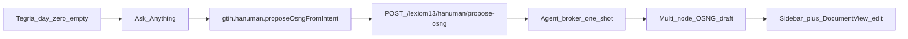

# Tegria day-zero: intent → OSNG proposal (1.B + 2.A)

**Overview:** Day-zero Tegria — empty garden, Ask Anything triggers one GTIH SDK call (`gtih.hanuman.proposeOsngFromIntent`) that returns a multi-node OSNG draft tree for review/edit — implemented as a Hanuman-labeled sibling path that must not touch the existing prepare/realize SUD pipeline.

## Todos

- [ ] Add isolated lib + `POST /lexiom13/hanuman/propose-osng` (agent-broker OSNG draft; no prepare/CA)
- [ ] Ship thin `gtih-sdk.js` `proposeOsngFromIntent`; update gtih `API.md` + openapi (Known divergence)
- [ ] Empty day-zero UI, Vite→GT3 proxy, wire Ask Anything → map multi-node OSNG into tree + editable docs
- [ ] Add propose unit test; re-run lexiom13 build/SUD tests to confirm no Hanuman realize regression

## Governance

- Checked: root `README.md`, `public/gt2/gtih/API.md`, `public/gt2/Lexiom_1_3/ca/README.md`, Tegria stubs under `public/gt2/tegria/`.
- **Known divergence (explicit):** Lexiom constitution says Ram grows the OSNG and Hanuman realizes SUDs. Day-zero **stretches the Hanuman GTIH control-plane name** with a new propose operation that uses **agent-broker labor** to draft a multi-node OSNG. This is **not** CA WebContainer SUD composition.
- **Non-negotiable:** no regression to today’s prepare → run → `composeBookShapedSud` / software realize path (covered by existing `tests/lexiom13-*.test.mjs`).

## Locked product shape

- **Day zero:** no Checkout/brief mock; empty left tree + empty/placeholder document + working Ask Anything.
- **One frontend SDK call** from Tegria: `gtih.hanuman.proposeOsngFromIntent({ intent })`.
- **Result:** multi-node OSNG-shaped draft (`root` + children with `graph.parent_osn_ids` / `child_osn_ids`) mapped into Tegria sidebar + editable document panes.
- Proposal stays **client draft** for this experiment (review/edit in UI). Canonizing into `Lexiom_1_3/*.osn.yaml` is out of day-zero acceptance.

## Isolation strategy (no SUD regression)

| Touch | Rule |
|-------|------|
| `lib/lexiom13BuildPlugins.js` `prepareLexiom13Build` / run | **Do not change** behavior for SUD builds |
| `public/gt2/Lexiom_1_3/ca/composeBookShapedSud.js` + CA serve | **Do not change** |
| New propose path | **New module + new HTTP route**, sibling under Hanuman tag |
| Regression gate | Re-run `tests/lexiom13-build-two-step.test.mjs`, `lexiom13-document-context-economy.test.mjs`, `lexiom13-build-evidence.test.mjs` after implement |

## Backend (GT3)

1. Add `lib/lexiom13HanumanProposeOsng.js` (name may vary):
   - Input: `{ intent: string }` (+ optional size hints).
   - Calls agent broker (same key lane as Hanuman builds / attribution) with a **dedicated propose-OSNG system prompt**.
   - Asks for structured JSON: array of OSN drafts (`schema_version: osn/0.2` fields: `id`, `title`, `seed`, `thematic_lenses`, `output_spec`, `success_evidences`, `graph.*`), rooted for a new SUD intention.
   - Validates/normalizes reciprocal graph links; assigns draft ids if missing.
   - Returns `{ root_osn_id, nodes: [...] }` — **no** write into `public/gt2/Lexiom_1_3/`, **no** prepare worktree, **no** CA ticket.
2. Wire `POST /lexiom13/hanuman/propose-osng` in `server.js`.
3. Unit test: mock broker → stable multi-node shape; assert prepare/realize modules unused.

## GTIH SDK + contract

1. Implement thin `public/gt2/gtih/gtih-sdk.js` (`window.gtih`) with at least:
   - `gtih.hanuman.proposeOsngFromIntent({ intent })` → single `fetch` to the new route (await full JSON; no Tegria-side multi-step).
   - Minimal config: `baseUrl` (default same-origin / proxied).
2. Update `public/gt2/gtih/API.md` + `openapi.yaml`: new `hanumanProposeOsng` operation; short **Known divergence** note that this drafts OSNG and does not replace realize.
3. Brief pointer in `public/gt2/tegria/API.md`: Tegria day-zero consumes this GTIH method (wrapper still optional).

## Tegria frontend (`Tegria_frontend/`)

1. **Vite proxy** in `vite.config.ts`: proxy `/lexiom13` (and broker path if needed) → `http://localhost:8080` so the SDK call reaches GT3 while `npm run dev` stays on 5173.
2. Load/import GTIH SDK (script from GT3 public or local copy of the thin client).
3. **Day-zero state** in `MainLayout.tsx` (and related):
   - Start with empty `treeData` / no pages (remove Checkout mock as default).
   - Wire `ChatPanel.tsx`: real input + Send → one `proposeOsngFromIntent` call; loading/error affordance.
4. **Map response → UI (2.A):**
   - Each OSN → sidebar node (depth from graph); root at tree root.
   - Selecting a node → `DocumentView` showing editable sections from OSN fields (`title`, `seed`, lenses, `output_spec`, evidences).
   - Keep existing contentEditable + `localStorage` persistence for edits (proposal review loop).
5. Replace hardcoded `pages.ts` / Sidebar `treeData` with state driven by the proposal (mock Checkout only if explicitly re-enabled for demos — default off).

## Acceptance criteria (this experiment)

- Open Tegria day-zero: empty garden (no Checkout/brief mock).
- User types SUD intent in Ask Anything → **one** `gtih.hanuman.proposeOsngFromIntent` call.
- Left tree fills with a **multi-node** OSNG-shaped proposal; user can open nodes and edit text.
- Existing Lexiom 1.3 Hanuman SUD prepare/realize tests still pass unchanged in behavior.

## Out of scope (follow-ups)

- Canonize proposal into Lexiom OSN files / White Moves maturation loop.
- Tegria remote tenant SDK enrichment.
- CA WebContainer used for OSNG drafting.
- Full GTIH method surface beyond propose + whatever the thin client needs for baseUrl.
